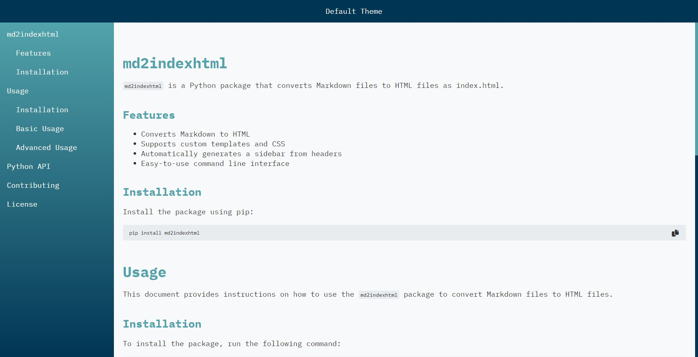
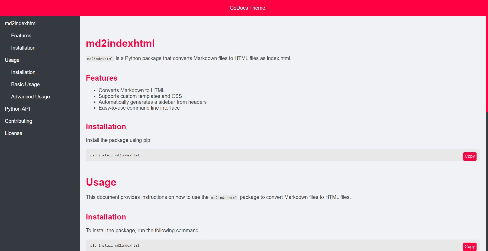
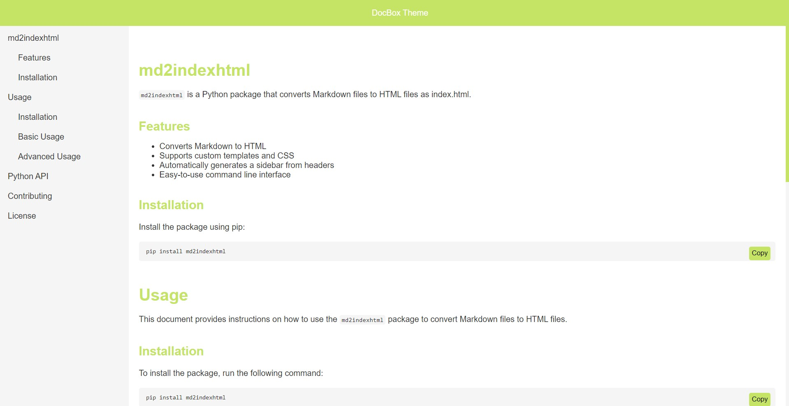

# md2indexhtml

`md2indexhtml` is a Python package that converts Markdown files to HTML files as index.html.

## Features

- Converts Markdown to HTML
- Supports custom templates and CSS
- Automatically generates a sidebar from headers
- Easy-to-use command line interface

## Installation

Install the package using pip:

```bash
pip install md2indexhtml
```

# Usage

This document provides instructions on how to use the `md2indexhtml` package to convert Markdown files to HTML files.

## Installation

To install the package, run the following command:

```bash
pip install md2indexhtml
```

## Basic Usage

To convert a Markdown file to an HTML file using the default settings, run the following command:
```bash
md2indexhtml path/to/yourfile.md
```

## Advanced Usage

You can customize the conversion by providing additional options:
 
- `output_dir`: Directory to save the output HTML file.
- `template`: Path to the HTML template.
- `css`: Path to a custom CSS file.
- `title`: Title for the HTML document and navbar.

Example:
```bash
md2indexhtml path/to/yourfile.md path/to/output/dir --template path/to/template.html --css path/to/custom.css --title "My Documentation"
```

## Themes

### Default Theme



### GoDocs Theme



### DocBox Theme



# Python API

You can also use the package programmatically in your Python code:

```python
from md2indexhtml import convert_md_to_html

convert_md_to_html(
    md_file_path="path/to/yourfile.md",
    output_dir="path/to/output/dir",
    template_path="path/to/template.html",
    custom_css_path="path/to/custom.css",
    title="My Documentation"
)
```

# Contributing

Contributions are welcome! Please feel free to submit a pull request or open an issue on GitHub.

# License
This project is licensed under the MIT License.

```
Feel free to adjust any of the content to better suit your needs.
```